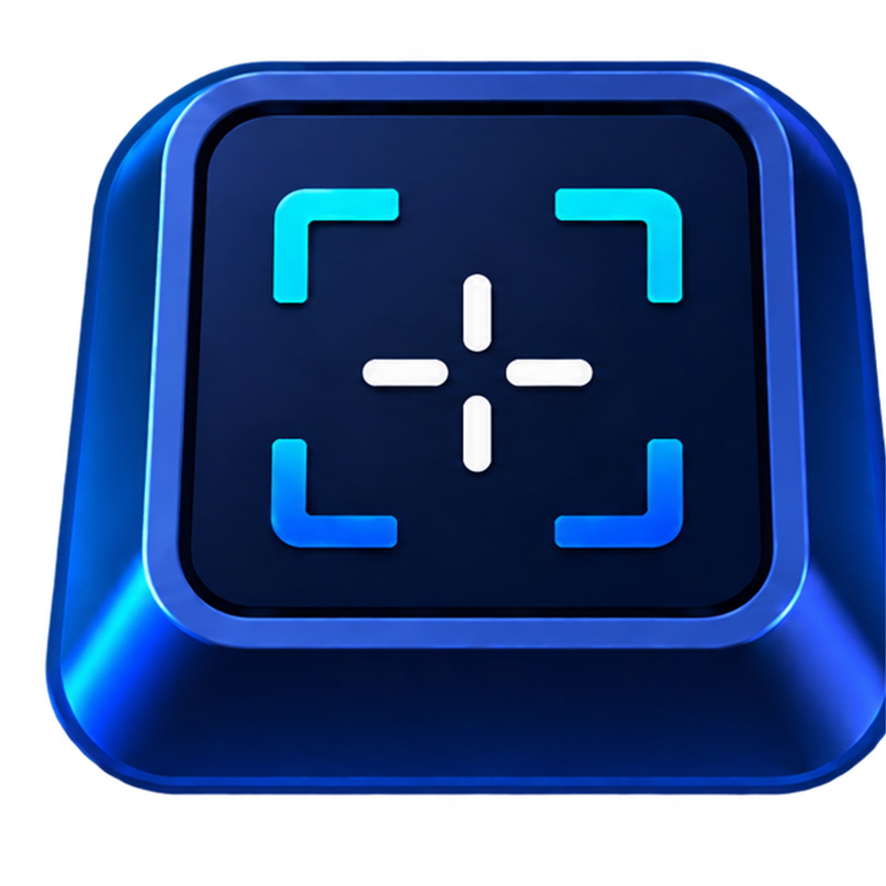
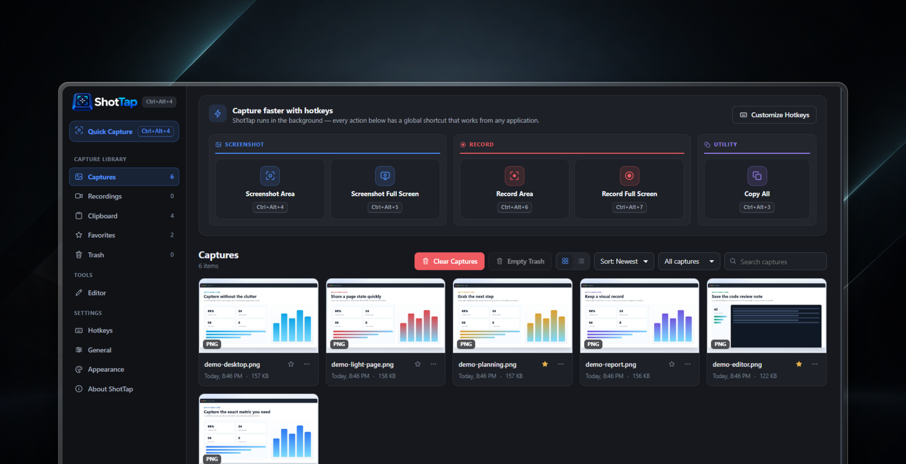
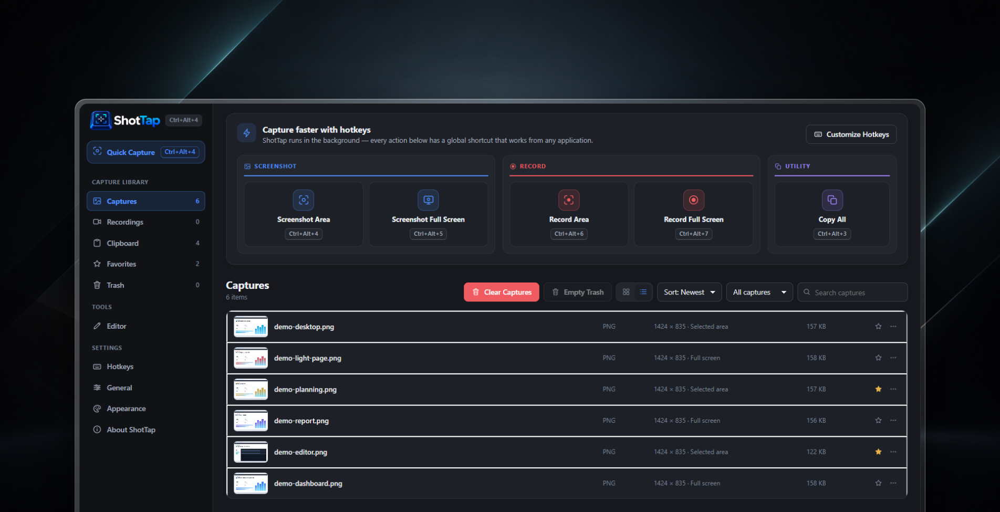
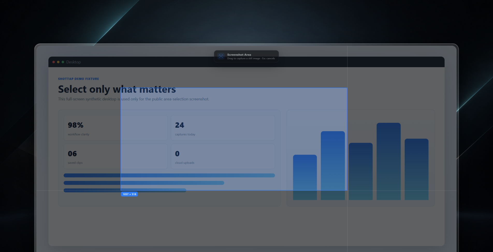
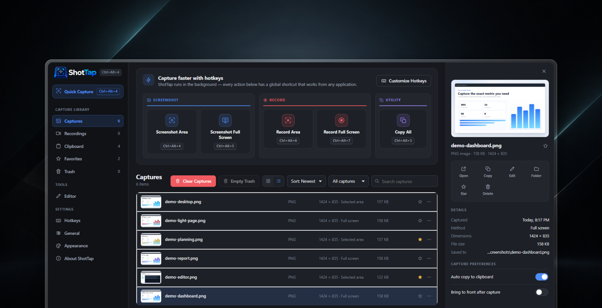
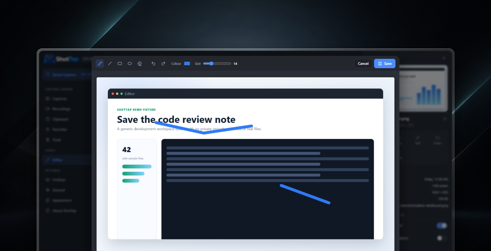
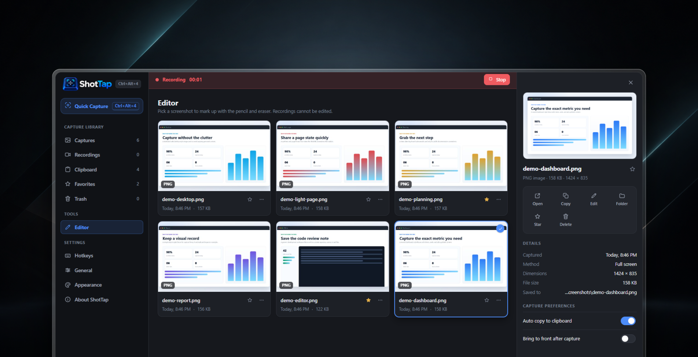
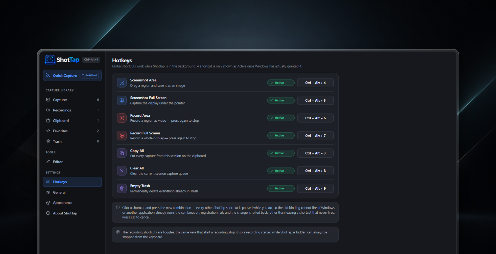
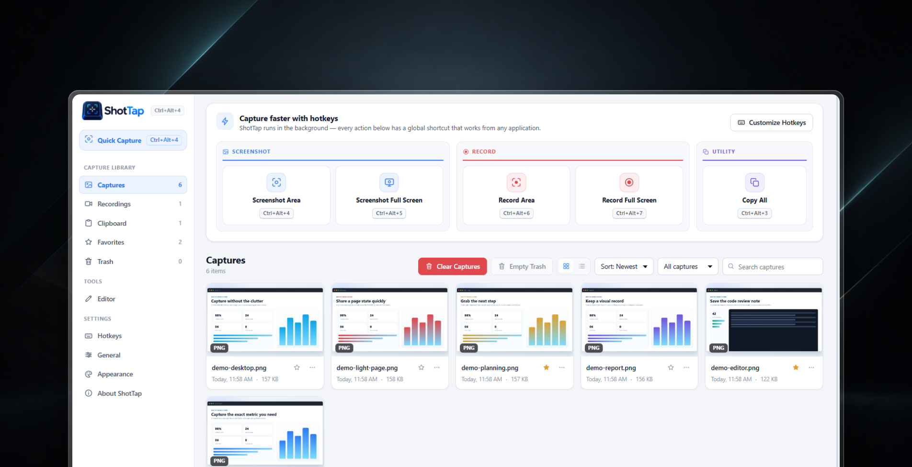

<p align="center">
  
</p>

# ShotTap

Fast screen capture without breaking your flow.

ShotTap is a keyboard-first screenshot and screen-recording tool for Windows, built for fast capture, instant clipboard workflows, cleanup shortcuts, and local organization without interrupting what you're doing.

[](https://github.com/VLStudio1/shottap/actions/workflows/ci.yml)
[](LICENSE)


## Preview



The screenshots in this README use synthetic demo content captured from the real ShotTap application, then placed on an AI-generated presentation backdrop for GitHub.

## Why ShotTap?

ShotTap is built for people who capture often and want the app to stay out of the way. Global shortcuts let you capture from any application, screenshots can go straight to the clipboard, and the local library keeps captures, recordings, favorites, and trash in one place.

## Features

### Capture

- Area screenshots
- Full-screen screenshots
- Area recording
- Full-screen recording
- Global keyboard shortcuts
- Instant clipboard copy
- Multi-capture clipboard workflows with Copy All
- Shortcut-driven queue clearing and trash cleanup

### Recording

- System audio recording
- Optional microphone recording
- Native, 1080p, and 720p recording quality options
- 24, 30, and 60 FPS options where supported
- WebM recording output

### Library

- Capture library
- Recordings library
- Search, sorting, and filtering
- Favorites
- Trash, restore, and empty-trash flows
- Grid and list layouts
- Inspector/details panel

### Editing

- Screenshot editor
- Pencil tool
- Eraser tool
- Brush color
- Brush size
- Undo and redo

### Personalization

- Light mode
- Dark mode
- System theme
- Configurable hotkeys
- Configurable save location

## Download / Installation

Public downloads are provided through [GitHub Releases](https://github.com/VLStudio1/shottap/releases).

ShotTap has two Windows release formats:

- **Installer:** a normal Windows installation with Start Menu and desktop shortcut support.
- **Portable:** a standalone executable that can run without a normal installation.

Current build artifact names are:

- `ShotTap-Setup-0.5.0.exe`
- `ShotTap-Portable-0.5.0.exe`

## Screenshots

| Capture Library | Area Selection |
| --- | --- |
|  |  |

| Inspector | Editor |
| --- | --- |
|  |  |

| Recording | Hotkeys |
| --- | --- |
|  |  |

| Light Mode |
| --- |
|  |

## Keyboard Shortcuts

Default shortcuts are chosen to avoid common Windows capture shortcut conflicts. Shortcuts can be customized in ShotTap's Hotkeys settings.

| Action | Default hotkey |
| --- | --- |
| Screenshot Area | `Ctrl+Alt+4` |
| Screenshot Full Screen | `Ctrl+Alt+5` |
| Record Area | `Ctrl+Alt+6` |
| Record Full Screen | `Ctrl+Alt+7` |
| Copy All | `Ctrl+Alt+3` |
| Clear All | `Ctrl+Alt+8` |
| Empty Trash | `Ctrl+Alt+9` |

## Privacy

ShotTap is designed to work locally. Screenshots and recordings are stored on your computer. ShotTap does not require an account and does not contain telemetry, analytics, advertising, or built-in cloud-upload functionality.

As with any screen capture tool, be careful when sharing screenshots, recordings, logs, or bug reports. Redact sensitive information before posting anything publicly.

## Portable Version

The portable build is intended for running ShotTap without a normal Windows installation. It still stores settings and captures locally on the machine where it runs, and it uses the same capture, recording, clipboard, library, and hotkey features as the installer build.

## Build From Source

For developers who want to run ShotTap locally:

```bash
git clone https://github.com/VLStudio1/shottap.git
cd shottap
npm ci
npm start
```

## Run Tests

```bash
npm test
```

More development and release notes are in [CONTRIBUTING.md](CONTRIBUTING.md).

## Project Structure

| Path | Purpose |
| --- | --- |
| `src/main` | Electron main process, capture/recording orchestration, settings, library, shortcuts, clipboard, and windows |
| `src/preload` | Safe renderer-facing bridges for main, selection, and recorder windows |
| `src/renderer` | Main application UI, editor UI, formatting, icons, styles, and assets |
| `src/selection` | Area-selection overlay |
| `src/recorder` | Hidden recording window and MediaRecorder logic |
| `src/shared` | Constants shared across processes |
| `test` | Node tests and Electron self-test runner |
| `build` | Application icon assets used by packaging |

## Contributing

Contributions are welcome. Please read [CONTRIBUTING.md](CONTRIBUTING.md) before opening a pull request.

For UI changes, include screenshots or short recordings when possible, and avoid attaching sensitive screen content.

## Known Limitations

- ShotTap is currently focused on Windows.
- Recordings are written as WebM.
- Windows binaries are not code-signed yet, so SmartScreen may warn on downloaded builds.
- There is no automatic updater yet.
- Area selections are constrained to one display when a selection crosses monitor boundaries.

## Security

ShotTap handles potentially sensitive screen content. Please do not report security vulnerabilities in public issues. See [SECURITY.md](SECURITY.md) for private reporting guidance.

## Roadmap

These are directions, not commitments or dated promises:

- Improve capture and editor workflows
- Expand recording options
- Improve multi-monitor handling
- Packaging and signing improvements
- Community-requested features

## License

ShotTap is released under the [MIT License](LICENSE).
